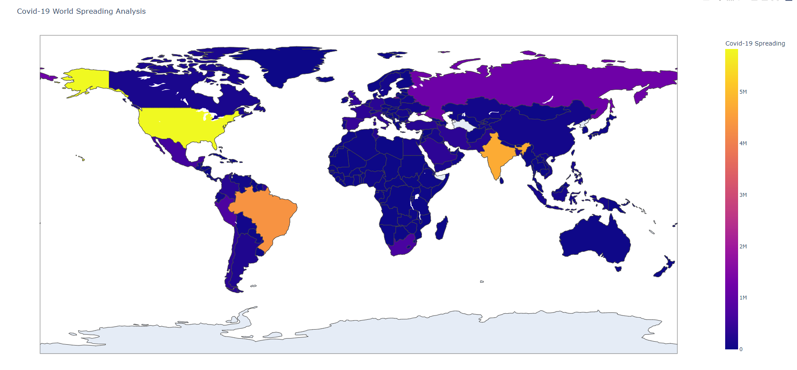
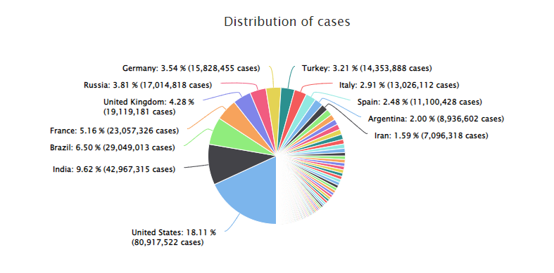
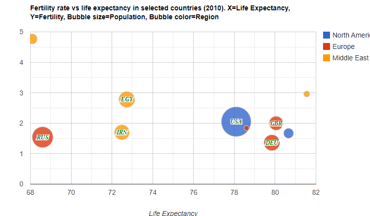

## Background

The pandemic is one of the big issue. It affects negatively to the world economic, mental health, and many other things.
Our visualization is to emphasize the huge damage of the pandemic as well as to help us in making decision to decrease the effect of pandemic and stop the spreading of the Corona virus.

## Motivation

The visulization will give us an overview of the epidemic situation around the world by the end of 2021. From this data one can see the spread and huge impact of the pandemic. Thanks to that, we can limit going to areas with strong outbreaks and understand the danger of the disease, thereby joining hands to fight the disease.

## Objective

From the visulization, we can:
- See which regions of the world have the most and the fewest covid cases
- See the density of cases in the world

## Where and how to collect the data

The data is mostly collected from [ourworldindata](https://ourworldindata.org/coronavirus).

[Link github to the data](https://github.com/owid/covid-19-data/tree/master/public/data)

## Features

- Show how many cases infected,  dead-cases by covid_19 in selected regions 

- Show the proportion of these cases in selecd regions compare to the total cases in the world

- Show the proportion of civilian got vaccinated 

Optional features:
- The chart will be updated in real-time.

## 3 alternative prototype designs
- Map

- Pie chart

- Bubble chart

## Project Schedule :
The project was separated into three segments by our team:
- Stage 1 (2 weeks): choose topics and generate ideas for visualization
- Stage 2 (12 weeks) : Select data and choose 3 design visualizations: map, pie chart, and bubble. We consider these designs because they present an intuitive, easy-to-understand, easy-to-understand way to clearly convey complete insights from the data to the viewer, the reader. Then build a web and give them some interactive features.
- Stage 3 (6 weeks) : give story telling and submit project.