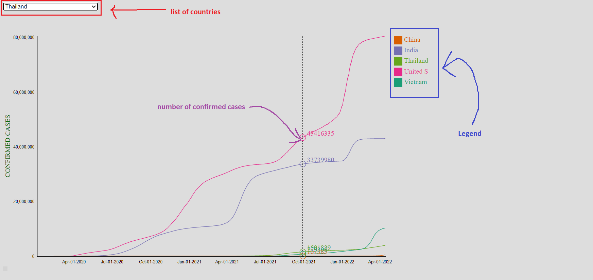

# Exponential Growth of Covid Spreading and when it ends.
## **Motivation**
You heard about many shocking news about the COVID-19 everyday on TV and social media everyday? You feel panic and depressive because of the non-stop increasing number of cases and deaths, and you have no clue about when everything back to normal for you to continue your big journey? Do not be hopeless, our visualization project will analyze the process and give more details clearly, where we are in the progress of COVID-19, and predict when it will stop.

## **What is exponential growth?**
## **Introduction of our project**

Our project has 2 line charts, one is multiple line chart, and the other is single line chart with updating time in order to visualize and compare the total confirmed cases all over 200 countries in the world (from 8/3/2020 to yesterday).

### **Multiple line chart:**

The multiple line chart is used for: 
- Comparing the total confirmed cases of multiple countries all at once
- Showing the overview changes and trends over time

We choose the multiple line chart because it is simple, easy to compare and predict efficiently.

**Interactive**
- Users can choose which country we wish to compare.
- The detail of number cases at particular time is revealed according to the vertical position of mouse.
- Users can click on the name of the country in the legen area to delete the line of the country

About figure above, the top-left corner contains the list of coutries for the user to add for the multiple line chart.

The legend is on the right of screen.

The y-axis indicates the total confirmed cases with linear scale

The x-axis is the timeline.

Each country is assigned by different color.

### **Single line chart**

Unlike the multiple line chart, the single line chart is able to show only one country at once. However, it is helpful for us in:

- Detecting when the number of cases growth

## **VietNam**

<svg height="25" width="211"><line x1="0" y1="25" x2="211" y2="25" style="stroke:rgb(221,160,221);stroke-width:30" /></svg><svg height="25" width="296"><line x1="0" y1="25" x2="296" y2="25" style="stroke:rgb(186,85,211);stroke-width:30" /></svg><svg height="25" width="152"><line x1="0" y1="25" x2="152" y2="25" style="stroke:rgb(148,0,211);stroke-width:30" /></svg><svg height="25" width="147"><line x1="0" y1="25" x2="147" y2="25" style="stroke:rgb(139,0,139);stroke-width:30" /></svg>
