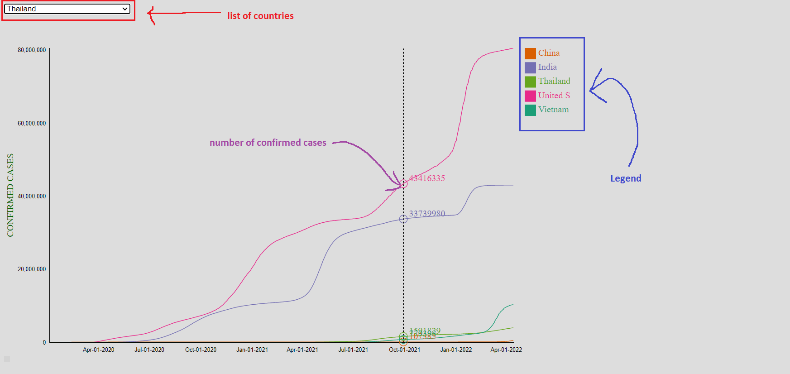

# Brief visualization for Exponential Growth of Covid Spreading
## **Motivation**
You heard about many shocking news about the COVID-19 everyday on TV and social media everyday? You feel panic and depressive because of the non-stop increasing number of cases and deaths, and you have no clue about when everything back to normal for you to continue your big journey? Do not be hopeless, our visualization project will analyze the process and give more details clearly, where we are in the progress of COVID-19, and predict when it will stop. Our ultimate goal is to express clearly meaning of the terms "exponential growth" in the COVID-19 context as well as other contagious disease in general.

## **What is exponential growth?**
The phrase "exponential growth" is familiar to most people, however the human intuition has a hard time to reconizing what it means sometimes. Unlike the linear growth (each day it increase by a constant), the number in exponential growth is updated by multiply with a small $ratio > 1$. The main reason why the exponential growth is dangerous in terms of pandemic situation is that the number of infections in the beginning is pretty small, this naturally causes humans underestimates it, and it suddenly suprises people with the huge amount of cases and then the overall cases follows exponential trend perfectly consistently. 

Our visualization will dig into visualize this kind of growth to help people recognize the pattern intuitively.
## **Introduction of our project**

Our project has 2 line charts, one is multiple line chart, and the other is single line chart with updating time in order to visualize and compare the total confirmed cases all over 200 countries in the world (from somewhere in the beginning of 2020 to yesterday).

[Link to the data](https://github.com/owid/covid-19-data/blob/master/public/data/owid-covid-data.csv) - Our World in Data is a project of the Global Change Data Lab, a non-profit organization based in the United Kingdom.

### **Multiple line chart:**

The multiple line chart is used for: 
- Comparing the total confirmed cases of multiple countries all at once
- Showing the overview changes and trends over time

We choose the multiple line chart because it is simple, easy to compare and predict efficiently.

**Interactive**
- Users can choose which country we wish to compare.
- The detail of number cases at particular time is revealed according to the vertical position of mouse.
- Users can click on the name of the country in the legend area to delete the line of the country

About figure above, the top-left corner contains the list of coutries for the user to add for the multiple line chart.

The legend is on the right of screen.

The y-axis indicates the total confirmed cases with linear scale

The x-axis is the timeline.

Each country is assigned by different color.

### **Single line chart**

Unlike the multiple line chart, the single line chart is able to show only one country at once. However, it help us to see the progress in detail, in other words, the users can run the line chart by select the number of days.

**Interactive**
- User can choose any country in the list of countries.
- There are 2 ways to select the number of days: 
    - Enter a number in the box
    - Press or click the up arrow beside the box to increase the number of day.

## **Vietnam**

We chose Vietnam as an illustrative example to provide an intuitive and easy-to-compare view of the dangers of this pandemic.

Description for the above figure:
- This is an overall timeline for number of cases in Vietnam
- At the beginning of the pandemic, it took 211 days to reached more than $10^3$ cases.
- The number of total cases increase $10$ times to $10^4$ after 296 days.
- After the half of the timeline, the time it need to rise 10 times is shorter such that after 44 days it reached $10^5$, 109 days to reached $10^6$ cases and 147 days to reacched $10^7$.
- Until now it reached more than 10 millions cases.

## **Thailand**

Description for the above figure:
- This is an overall timeline for number of cases in Vietnam
- At the beginning of the pandemic, it took only 83 days to reached more than $10^3$ cases.
- The number of total cases increase $10$ times to $10^4$ after 289 days (372 days in total).
- After the half of the timeline, the time it need to rise 10 times is shorter such that after 127 days (499 days in total) it reached $10^5$, 97 days to reached $10^6$ cases (596 days in total).
- Until now it reached more than 4 millions cases.

## **Overall trend of some typical countries**
Here is the multiple line chart to illustrates the trend for 5 typical countries:
- 3 big countries with highest population: India, United States, China
- 2 small countries near each other: Vietnam, Thailand.

According to the above figure, there are 3 things that should be considered here:
- Suprisingly, China is the lowest compare to 5 sample countries, though it is the root of the deadly virus as well as it has the highest population in the world. 
- The US-a major economic in the world is suffering the most severe effects of the epidemic, with more than 84 millions confirmed cases and consistently maintain the #1 quantity of infections in the world
- The the total cases of small countries like Vietnam Thailand look very small compare with United States and India.
- All of them follow the exponetial growth.
